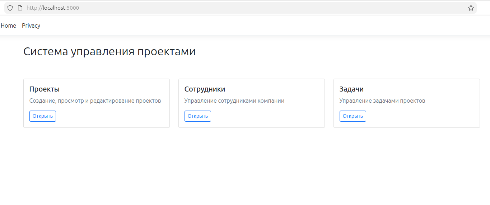
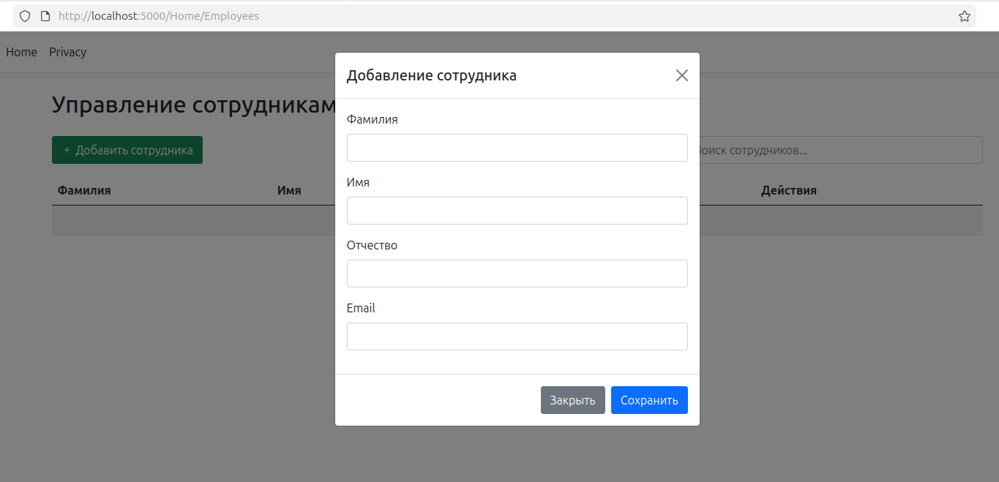
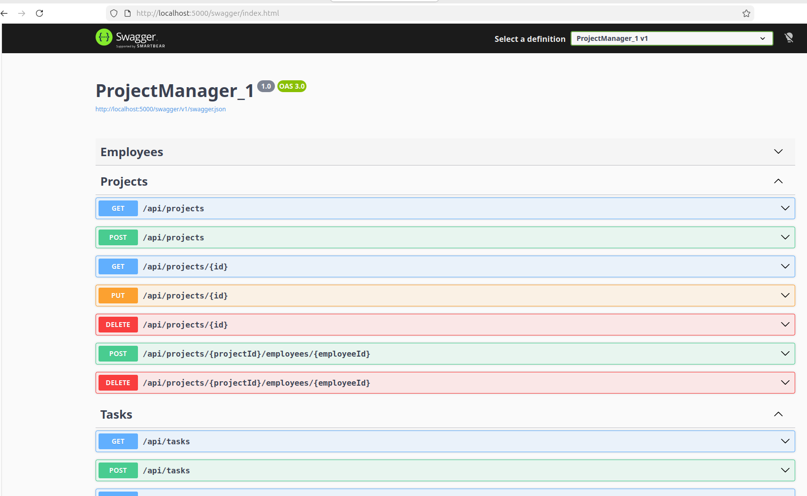

# SibersTest

## Образец

### API (Swagger)




### API (Swagger)



---

## Запуск проекта

### Через Docker

```bash
docker compose up --build
```
## После запуска перейти

http://localhost:5000/ - Главная

http://localhost:5000/swagger/ - Свагер